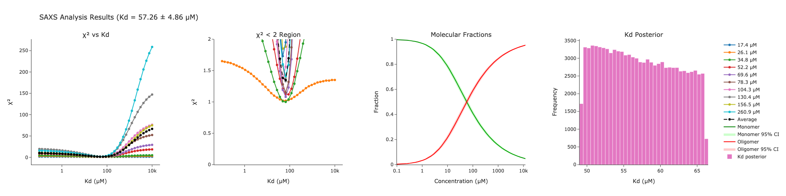
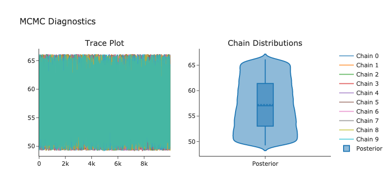

# KdSAXS bayesian
A Bayesian implementation of [KdSAXS](https://github.com/TiagoLopesGomes/KdSAXS) for calculating dissociation constants from SAXS data for a simple monomer-oligomer model.


## Usage
1. Ensure ATSAS software suite is installed and accessible
2. Check the examples below (for Beta-Lactoglobulin protein oligomerization) or upload your own and change the script accordingly:
   - Theoretical data: `examples/blg/ph7/theoretical_saxs/`
   - Experimental data: `examples/blg/ph7/exp_saxs/`
3. Update the ATSAS_PATH in the script to point to your ATSAS installation and change other variables
4. Run the script and check example output interactive plots or figures below:
   ```
   python kdsaxs_bayesian.py
   ```
5. Check the [KdSAXS](https://github.com/TiagoLopesGomes/KdSAXS) repository for more extensive documentation.

## Method
The analysis uses Bayesian inference through MCMC sampling to determine protein oligomerization Kd values from SAXS data. The workflow:
1. Initial χ² calculation across a wide Kd range
2. Identification of Kd values where χ² < threshold
3. MCMC sampling within this range using a log-uniform prior
4. Generation of posterior distribution and credible intervals

## Optimization
The χ² threshold (default: 2.0) can be adjusted based on the quality of your data. Examine the χ² vs Kd plots to:
- Identify regions of good fit
- Adjust the threshold if needed
- Balance between fit quality and sampling range

## Limitations
- Requires manual setting of χ² threshold
- Assumes a simple monomer-oligomer equilibrium
- Limited to single-step oligomerization processes

## Dependencies
- Python 3.8+
- ATSAS software suite
- Required Python packages:
  - numpy
  - pandas 
  - scipy
  - plotly
  - pymc
  - arviz
  - pytensor

# KdSAXS bayesian analysis results example




[Interactive Analysis Results download](figures/saxs_analysis_results.html)

## MCMC example Diagnostics



[Interactive Diagnostics download](figures/saxs_diagnostics.html)

## Analysis Summary
- Kd = 57.30 ± 4.88 µM
- 95% Credible Interval: [49.59, 65.67] µM